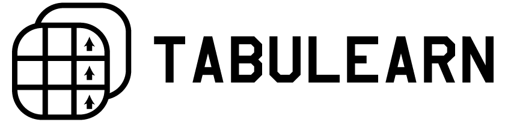

# Tabulearn

## Introduction
Tabulearn is a reinforcement learning toolkit. Tabulearn lets you solve discrete open ai gym environments with multiple reinforcement learning methods. The reason why I'm making this is to put together the algorithms I implemented from the Barto Sutton's book on reinforcement learning and use them for solving environments from the get go (everything in a single place).
### Purpose
Educational
## Methods Implemented
So far, I've implemented most of the tabular control methods but I'll probably add other methods like gradient methods from part 2 and others. I'll probably also add examples of solving problems later.
### TD Controls
- Sarsa
- QLearning
- DoubleQLearning
- ExpectedSarsa

### N Step TD Controls
- N-Step Sarsa
- N-Step Tree back up algorithm
- N Step Off Policy Control with Importance Sampling
- QSigma
### Methods which combine planning and learning
- DynaQ
- DynaQ+
- DynaQ with PrioritizedSweeping

## How to use
Just make a virtual environment, clone the repository and install requirements.
`git clone https://www.github.com/raufie/tabulearn.git`
`cd tabulearn`
`python -m venv .`
`pip install requirements.txt`

Open up main.py for a basic example, all methods should be able to solve open AI gym's discrete environments (environments with discrete state spaces e.g 0,1,2,3,4... its important that they be discretized like this). 

## Inspiration, Goals and Objectives
I just wanted to put things in a single place from the algorithms i implemented while following the reinforcement learning book. I'm at chapter 9 and will be adding more stuff. I have a repository named "reinforcement learning" where I've most of the notebooks for these algorithms. 
Main goals include turning this library into a framework in the future versions. Like we already have a methodbase that stores Q tables and provides useful methods, perhaps making different methods like NStepSarsa more easy to extend to. Everything is a methodbase so you can go in there and tweak things. Currently the train method is in a bad condition so its like writing the whole algorithm there, which I'll change.
## Other things
I also used torch instead of numpy for storing Q tables (naively thinking that it'll be faster on gpu, im not sure cuz ivent written it yet and the tables are usually smaller so it was dumb for sure but I had already written a few methods by then)
